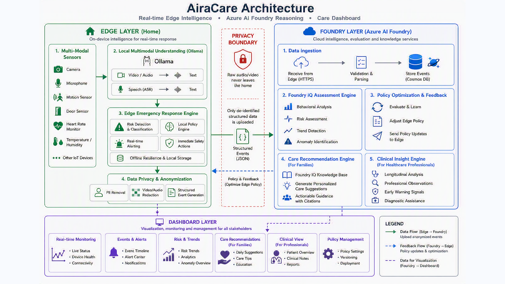

# AiraCare

**A guardian that watches on the edge, thinks in the cloud.**



AiraCare is a **hybrid edge–Foundry AI agent** for in-home Alzheimer's care. A local
**edge agent** does privacy-sensitive, real-time sensing **and self-determined graded
response** inside the home — it decides L0–L3 and acts **immediately, even offline**. A
**Foundry-hosted agent** does multi-event fusion, disease-stage reasoning, and long-horizon
learning in the cloud **asynchronously** — never on the real-time safety path. Together they
turn fragmented sensor alerts into **graded, explainable actions** caregivers can act on.

> Flagship scenario: **Nighttime Wandering** — 3 AM, the patient leaves the bedroom; the
> edge confirms by voice and escalates **on its own**, while the cloud follows up
> asynchronously with an enriched briefing.

## How it works, at a glance

1. **Edge (in the home)** — sensors + voice → on-device understanding (Whisper ASR, keyword/LLM
   intent) → **grade L0–L3 and act in milliseconds** (speak, light, alarm, SMS) → store-and-forward
   if offline. The edge is the **sole safety authority**.
2. **Privacy boundary** — only a de-identified, structured `DailyLivingEvent` crosses. **Raw
   audio/video never leaves the home.**
3. **Foundry (Azure AI Foundry)** — a hosted agent over **standard A2A**: deterministic middleware
   confirms the considered level *before* the model, `gpt-5.4` writes a grounded, **cited** briefing,
   and every event is persisted to **Cosmos DB** — all asynchronous.
4. **Dashboard** — a clinician-facing view reading the *same* Cosmos: cognitive trajectory, event
   mix, escalation funnel, nighttime risk.

## Why it's inherently hybrid

- **Privacy** — privacy-sensitive rooms (bedroom/bathroom) use **radar, not cameras**;
  where a camera or mic *is* used (e.g. the medication "pill-to-mouth" check), it's
  processed **on-device** and the **raw audio/video/point-cloud never leaves the home** —
  only a structured `DailyLivingEvent` crosses to the cloud.
- **Real-time + offline** — fall/wander detection and first response must be instant and
  keep working with no network.
- **Deep reasoning** — multi-event fusion, personalization, and graded decisions need the
  cloud (Foundry).

## Repository layout

| Path | What |
|---|---|
| [`spec/architecture.md`](spec/architecture.md) | Architecture, data flow, `DailyLivingEvent`, graded response ladder |
| [`spec/demo-scenarios.md`](spec/demo-scenarios.md) | Flagship + roadmap scenarios |
| [`spec/edge-design.md`](spec/edge-design.md) | Edge agent design (frameworks, models, state machine, voice pipeline) |
| [`spec/foundry-design.md`](spec/foundry-design.md) | Foundry Care Orchestrator design (async considered assessment, specialist tools, escalation, data layer; with an "as built" reconciliation) |
| [`spec/foundry-a2a-hosting.md`](spec/foundry-a2a-hosting.md) | How the hosted agent exposes **standard A2A** and preserves determinism (enablement runbook + design note) |
| [`spec/demo-runbook.md`](spec/demo-runbook.md) | **Step-by-step demo script** |
| [`spec/demo-video.md`](spec/demo-video.md) | 1–2 min demo-video storyboard + the `foundry_demo_feed` presenter |
| [`edge/`](edge/) | Edge agent implementation (Python) — see [`edge/README.md`](edge/README.md) |
| [`foundry-hosted-agent/`](foundry-hosted-agent/) | Foundry **hosted agent** (`airacare-care-orchestrator`) — deterministic considered assessment + escalation + Cosmos write, deployed on Azure AI Foundry Agent Service; see [`foundry-hosted-agent/README.md`](foundry-hosted-agent/README.md) |
| [`dashboard/`](dashboard/) | Standalone **care dashboard** (Python) reading the filed events from Cosmos — see [`dashboard/README.md`](dashboard/README.md) |
| [`FRICTION-LOG.md`](FRICTION-LOG.md) | **Microsoft Foundry friction log** — what worked well, what was confusing, what slowed us down, and missing capabilities (hackathon submission artifact) |

## Components

- **Edge agent** (`edge/`, this repo) — sensors (simulated) → real voice (TTS + mic +
  VAD + faster-whisper) → keyword/LLM understanding (Ollama Phi-3.5-mini) → **edge grades
  L0–L3 and acts locally** → reports the `DailyLivingEvent` via A2A → offline
  store-and-forward. **Runs CPU-only.**
- **Foundry Care Orchestrator** (`foundry-hosted-agent/`, this repo — see
  [`foundry-hosted-agent/README.md`](foundry-hosted-agent/README.md)) — the cloud "brain",
  **off the real-time safety path**, deployed as a **hosted agent** on **Azure AI Foundry Agent
  Service** (`gpt-5.4`) and reachable over the **standard A2A protocol**. The edge speaks A2A
  directly to it (`cloud.mode: foundry`); there is no bespoke A2A server. Determinism is
  preserved by pre-model middleware: it computes the **considered level** and starts the
  ack-tracked **escalation ladder** (never the advisory model), then a persistence middleware
  writes the privacy-scrubbed `DailyLivingEvent` to **Cosmos DB** (live, via Managed Identity).
  The model narrates a caregiver briefing grounded in a **Foundry IQ** knowledge base (agentic
  RAG over Azure AI Search). A standalone **care dashboard** (`dashboard/`) reads the filed
  events straight from Cosmos (Fabric/OneLake + Power BI remain the stated production analytics
  target). For offline/CI, the edge runs against an **in-process stub** (`cloud.mode: stub`) — no
  network, no Azure.

## Quick start

**Edge** (CPU-only; the panel needs no mic or network):

```powershell
cd edge
python -m venv .venv
.\.venv\Scripts\Activate.ps1
pip install -e ".[dev]"
pytest -q -m "not slow"

# split-screen demo panel against the in-process cloud stub
python -m airacare_edge.cli --scenario no-response --panel
```

**Foundry hosted agent** (the cloud brain) — deployed to **Azure AI Foundry Agent Service**, not
run locally. Its deterministic middleware + Cosmos write are offline-testable in its **own** venv:

```powershell
cd foundry-hosted-agent
python -m venv .venv
.\.venv\Scripts\Activate.ps1
pip install -e ".[dev]"
pytest -q
# deploy/redeploy + A2A enablement: see foundry-hosted-agent/README.md and spec/foundry-a2a-hosting.md
```

**End-to-end (live)** — point the edge at the deployed Foundry A2A endpoint (Entra auth). The
edge forwards each `DailyLivingEvent` over standard A2A; the hosted agent returns the
deterministic considered assessment and writes the event to Cosmos:

```powershell
# edge/config.yaml -> cloud.mode: foundry, cloud.endpoint: <Foundry A2A endpoint>
python -m airacare_edge.cli --scenario no-response --cloud foundry --panel
```

**Care dashboard** (reads the filed events from Cosmos) — its **own** venv:

```powershell
cd dashboard
python -m venv .venv
.\.venv\Scripts\Activate.ps1
pip install -e ".[cosmos]"
python -m airacare_dashboard.server --config config.cosmos.yaml --port 8975   # open http://127.0.0.1:8975/
# offline dry-run with seeded demo data (no Azure): python -m airacare_dashboard.server --seed
```

For the full voice + LLM + offline demo, follow [`spec/demo-runbook.md`](spec/demo-runbook.md). To
record a 1–2 min walkthrough (real voice + the full Foundry response), see
[`spec/demo-video.md`](spec/demo-video.md) and run `spec/tools/foundry_demo_feed.py`.
