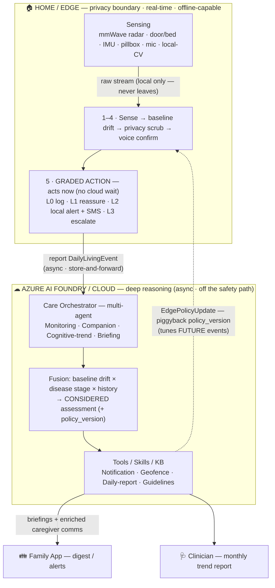
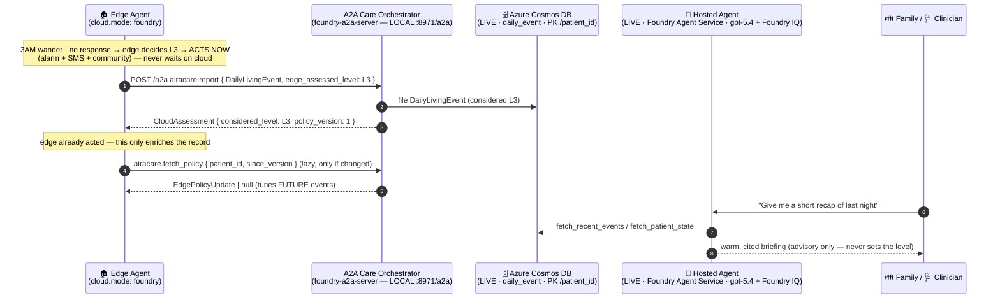

# AiraCare — Architecture Specification

**AiraCare** — Hybrid Edge–Foundry Agent for Alzheimer's Home Care
*A quiet guardian: watches on the edge, thinks in the cloud.*

---

## 1. Overview

AiraCare is a **hybrid AI agent** for in-home Alzheimer's Disease (AD) care. An
**edge agent** performs privacy-sensitive, real-time sensing **and self-determined graded
response** inside the home — it **decides and acts on its own, immediately, even offline**.
A **Foundry-hosted agent** performs multi-modal fusion, personalized reasoning, and
long-horizon learning in the cloud, producing **explainable briefings, enriched caregiver
notifications, and policy updates fed back to the edge** — asynchronously, **never on the
real-time safety path**. Together they turn fragmented sensor alerts into **graded actions
+ explainable briefings** that caregivers can actually use.

### Why this problem is inherently hybrid
- Bedroom/bathroom monitoring → raw data **must never leave the home** (privacy) →
  forces sensing onto the edge.
- Fall / wandering detection needs **millisecond response + offline fallback** →
  must be on the edge.
- Multi-event fusion, disease-stage learning, and personalization → best in the cloud
  (Foundry), fed back to the edge asynchronously as **policy updates** (never gating
  the real-time action).

This is not "hybrid for the sake of hybrid" — the solution is impossible without it.

---

## 2. Edge / Foundry Division of Responsibilities

### Edge Agent (in-home, privacy boundary, real-time, offline-capable)
| Challenge capability | How AiraCare Edge delivers it |
|---|---|
| Real-time interaction | Millisecond local decision for fall/wandering; voice guidance |
| **Autonomous graded response** | **Edge self-determines L0–L3 and acts immediately (reassure / local alert + SMS / escalate) — never waits for the cloud** |
| Device integration | mmWave radar + door/bed sensors + wearable IMU + smart pillbox |
| Local context awareness | Maintains today's rolling activity baseline on-device |
| **Privacy-sensitive processing** | **Raw audio/video/point-cloud never leaves home; only events + feature vectors uploaded** |
| Offline operation | Local light/sound alert + SMS to next of kin when disconnected |

### Foundry Agent (cloud, deep reasoning, orchestration)
| Challenge capability | How AiraCare Foundry delivers it |
|---|---|
| Deep reasoning & planning | Temporal fusion of events → **considered** assessment for reports/enrichment (not the real-time action) |
| Enterprise knowledge | Care guidelines / disease-progression knowledge base for advice |
| **Multi-agent orchestration** | Monitoring / Companion / Cognitive-trend / Briefing sub-agents |
| Toolboxes / Skills / Hosted Agents | Notification tool, geofence tool, daily-report Skill |
| **Edge policy / learning feedback** | Fusion/learning → **EdgePolicyUpdate** (thresholds, clarify retries, personalized prompts, disease-stage) applied by the edge for future events |
| **Complex multi-modal understanding** | Fuses radar + acoustic + behavior + voice cognitive trends |

**Multi-modal bonus:** Edge does real-time acoustic event detection on the voice
stream (cry-for-help / fall sound) plus passive collection of **cognitive voice
biomarkers** from daily conversation; edge does streaming inference, cloud does
batch trend modeling.

---

## 3. Architecture & Data Flow

```
╔═════════════ HOME / EDGE — privacy boundary · real-time · offline-capable ═════════════╗
║  Sensing: mmWave radar · door/bed · wearable IMU · smart pillbox · mic · local-CV cam   ║
║        │ raw stream (local only — never leaves)                                         ║
║        ▼                                                                                ║
║  Edge Agent — SELF-DETERMINED · acts immediately (no cloud wait):                       ║
║    1. Sense (local inference: fall · wander · med · meal · routine)                     ║
║    2. Personal baseline: rolling stats + drift                                          ║
║    3. Privacy scrub: discard raw A/V/point-cloud                                        ║
║    4. Active voice confirm + understand reply                                           ║
║    5. GRADED ACTION — ACTS NOW:                                                         ║
║         L0 log · L1 reassure (voice) · L2 local alert + SMS · L3 escalate (+community/120)║
║    6. Report to cloud (async · store-and-forward)                                       ║
║                                                                                         ║
║  ▲ applies EdgePolicyUpdate (async) → thresholds · prompts · disease-stage · retries    ║
╚════╪════════════════════════════════════════════════════════════════════════════════════╝
     │ ▲ EdgePolicyUpdate  (policy feedback — tunes FUTURE events)
     ▼ │
     │ │  report only DailyLivingEvent { type, confidence, features[], baseline_deviation,
     │ │                                 edge_assessed_level, edge_action_taken }
     │ │  (only structured events cross — raw A/V never leaves)
╔════╪═╪══════ AZURE AI FOUNDRY / CLOUD — deep reasoning (async · off the safety path) ══════╗
║    ▼ │  Care Orchestrator Agent — multi-agent:                                            ║
║      │    Monitoring · Companion · Cognitive-trend · Briefing                             ║
║      │    Fusion: baseline drift × disease stage × history → CONSIDERED assessment        ║
║      │    Tools/Skills/Knowledge: [Notification][Geofence][Daily-report][KB: guidelines]  ║
║      └── EdgePolicyUpdate ── (learning feeds back to the edge, for future events)         ║
║                                                                                          ║
║   briefings + enriched caregiver comms ──►  Family App (digest/alerts)  ·  Clinician      ║
╚════════════════════════════════════════════════════════════════════════════════════════════╝
```

*Rendered view (same flow — solid = event report, dashed = async policy feedback):*



**Key change from a naive design:** the edge does **not** wait for a cloud verdict. It
assigns its own `edge_assessed_level` and **acts immediately** (offline-safe). Only the
resulting `DailyLivingEvent` crosses (a report, fire-and-forget). The cloud reasons
asynchronously and sends **briefings + caregiver comms** outward and an **EdgePolicyUpdate**
back to the edge — tuning future behavior, never gating the current action.

---

## 4. Three Key Loops

1. **Safety loop (edge — authoritative · real-time · offline):** sense → confirm →
   **self-determined graded action** (L0 log / L1 reassure / L2 local alert + SMS /
   L3 escalate). The edge acts **immediately** and **never waits for the cloud**.
2. **Report & enrich loop (Edge → Foundry · async):** the edge **reports** the event +
   the action it already took; the cloud fuses across history → briefings/reports (family
   daily, clinician monthly) + enriched caregiver notifications. Store-and-forward when
   offline.
3. **Policy / learning loop (Foundry → Edge · async control plane):** the cloud's fusion +
   multi-agent learning produces an **EdgePolicyUpdate** (thresholds, clarify retries,
   personalized prompts, disease stage) that the edge applies to **future**
   events. Delivery is a **piggyback hint** — each report's `CloudAssessment` carries a
   `policy_version`, and the edge lazily pulls a new `EdgePolicyUpdate` only when it
   changes (no per-event policy, no blind polling). One capture serves both caregiver
   briefings and edge personalization.

---

## 5. Three Design Anchors (pitch talking points)

- **Privacy boundary** = the dashed line: raw audio/video/point-cloud stays in the
  home; only structured events go to the cloud → trustworthy.
- **DailyLivingEvent unified abstraction:** fall / wander / medication / meal all flow
  through one engine → elegant and extensible (answers the "vertical template"
  question).
- **Token economics:** the edge filters 99% of no-event data; only real events wake the
  cloud LLM → token-frugal, long-running, autonomous.

---

## 6. DailyLivingEvent — Unified Event Model

The edge collapses all monitored activities of daily living (ADL) into one abstraction
and **grades/acts** on every type through the **same** local engine. Foundry then applies
the **same** baseline-drift × disease-stage × fusion analysis for its **considered
assessment**, reports, and policy updates.

```jsonc
DailyLivingEvent {
  "type": "fall | wander | med | meal | routine",
  "confidence": 0.0-1.0,
  "timestamp": "ISO-8601",
  "patient_id": "string",
  "features": [ /* modality-specific feature vector, privacy-scrubbed */ ],
  "baseline_deviation": 0.0-1.0,   // drift vs the patient's own rolling baseline
  "edge_assessed_level": "L0 | L1 | L2 | L3",       // the edge's OWN immediate decision
  "edge_action_taken": "none | reassured | local_alert | escalated"
}
```

Adding a new monitored behavior (e.g. hydration, sleep) = a new `type`, **not** a new
system.

---

## 7. Graded Response Ladder

The **edge** assigns the level and **takes the action immediately** from local signals —
it never waits for the cloud. The **cloud** later produces a *considered* assessment (which
may match, enrich, or refine the record) plus caregiver briefings and edge policy updates.

| Level | Trigger (edge, immediate) | Edge action — now | Cloud — async, considered |
|---|---|---|---|
| L0 self-handle | minor deviation | log locally + report | curate into daily report |
| L1 gentle guidance | suspected anomaly | edge **reassures/guides** by voice ("it's late, let's rest") | note pattern; personalize the future prompt (policy) |
| L2 notify caregiver | medium risk | **local alert + SMS to kin** | enrich caregiver comms with fused context ("3rd wander this week") |
| L3 emergency escalation | fall no-response / left geofence / no-response wander | **escalate**: alarm + SMS + community/emergency | attach fusion context + replay; file report |

**Notification principles:** anti-alert-fatigue (grading + aggregation + quiet hours);
explainable (every alert carries *why* + *what to do*); deliverables = family daily
briefing + clinician monthly trend report.

---

## 8. Verified end-to-end flow — Edge → cloud orchestrator → Azure (as built, 2026-07)

The hybrid loop above is **built and verified**, not just designed. The edge switches from its
in-process stub to the A2A cloud orchestrator with **config only** (`cloud.mode: foundry`, or
`--cloud foundry --endpoint …/a2a`) — **zero edge code changes**. The edge's *report path*
speaks the frozen **A2A** contract (`airacare.report` / `airacare.fetch_policy`) to the
**A2A Care Orchestrator** (`foundry-a2a-server/`), which files the `DailyLivingEvent` and
returns the async *considered* assessment.

> **What is actually live vs local — read this before demoing.** In the 2026-07-17 run the
> A2A Care Orchestrator ran **locally** (`http://127.0.0.1:8971/a2a`) — that endpoint is a
> **local process, NOT an Azure/Foundry URL**. The `foundry` mode name only selects the A2A
> HTTP client; it does not imply a cloud endpoint. What *is* genuinely **live Azure** in the
> run: (a) the orchestrator persisted to **Azure Cosmos DB** (`airacare-5cciixoa3zpdk`), and
> (b) the **Hosted Agent** briefing (`azd ai agent invoke`) is **deployed on Azure AI Foundry
> Agent Service** (gpt-5.4 + Foundry IQ). **Not yet deployed:** a *cloud-hosted A2A* endpoint —
> the ACA A2A host (`infra/foundry.bicep`) was **removed** in favor of the Responses-protocol
> Agent Service, which does **not** speak the edge's `airacare.report` contract. Pointing the
> edge at a real Azure A2A URL would require deploying `foundry-a2a-server` (e.g. to ACA); the
> edge client/contract is unchanged, so it is a deploy step, not a code change.

The Responses-protocol **Hosted Agent** (`foundry-hosted-agent/`, gpt-5.4 + Foundry IQ) is a
separate *conversational* surface over the **same** Cosmos data — it is **not** on the edge's
A2A report path.



**Verified evidence (2026-07-17):**

| Check | Result | Where it ran |
|---|---|---|
| Edge switch to A2A orchestrator | `--cloud foundry --endpoint http://127.0.0.1:8971/a2a` — panel cloud pane read **`foundry`** (the config mode, not the stub); **no code change** | local |
| A2A request received | server log: `[a2a] POST /a2a method=airacare.report id=1 -> 200` | local process |
| Async considered assessment | returned **L3**, `policy_version: 1`, + caregiver notification | local process |
| Written to Cosmos | `daily_event` count **40 → 41**; the exact L3 wander event (`285c6512…`, `ts 2026-07-13T03:00:00Z`) filed | **live Azure Cosmos** |
| Hosted agent (same Cosmos) | `azd ai agent invoke` → gpt-5.4 briefing grounded in **Foundry IQ** with cited sources (`nighttime-wandering.md`, `exit-seeking-elopement.md`, …), reading the same events | **live Azure Foundry Agent Service** |
| Safety authority | the cloud/hosted agent **never** set or changed the risk level — the edge remained the sole safety authority | — |

This exercises the loop the design promised: the edge **decides and acts locally**, only the
structured `DailyLivingEvent` crosses the privacy boundary, and the cloud path reasons
**asynchronously** — records to **live Cosmos**, a considered assessment + policy hint back to
the edge, and a **live** hosted-agent cited briefing out to family/clinicians. The one honest
caveat is that the A2A orchestrator process was local in this run; graduating it to a cloud A2A
endpoint is a deployment step, not an edge change.
