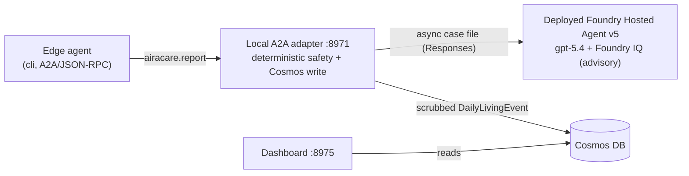

# AiraCare — Demo Run-book

Step-by-step script for demoing the **flagship Nighttime Wandering** scenario end to end.
The demo shows the three pitch anchors — **hybrid division of labor**, the **privacy
boundary**, and **graded escalation** — plus **real-time voice**, **on-device LLM
understanding**, and **offline resilience (store-and-forward)**.

> **Cloud side (now built — same repo).** The Foundry **Care Orchestrator** is implemented
> and deployed: a deterministic **A2A drop-in** (`foundry-a2a-server/`) that speaks the frozen
> contract and writes to Cosmos, plus a **deployed Azure AI Foundry Agent Service**
> conversational agent (`foundry-hosted-agent/`) on `gpt-5.4` with a Foundry IQ knowledge base.
> Beats 1–4 below demo the **edge** against a local A2A stub (fast + offline-safe); **Beats 5–6**
> add the live cloud agent and the care dashboard. Switching the edge to real Foundry is
> config-only (`cloud.mode: foundry`).

---

## 0. Prerequisites (one-time)

- Windows devbox (CPU-only is fine), Python 3.10+.
- **Mic + speaker** available (on the devbox this is redirected **Remote Audio** over RDP —
  verified working).
- **Ollama** installed and running with the model pulled:
  ```powershell
  winget install --id Ollama.Ollama -e
  ollama pull phi3.5
  ```
- Edge environment:
  ```powershell
  cd C:\Users\<you>\Workspace\repos\AiraCare\edge
  python -m venv .venv
  .\.venv\Scripts\Activate.ps1
  pip install -e ".[dev,audio,llm]"
  pytest -q -m "not slow"      # expect all green
  ```

## 1. Pre-flight (before you present)

- Close Chrome/Teams to free RAM (the models need ~4–5 GB).
- Confirm Ollama server is up:
  ```powershell
  (Invoke-WebRequest http://127.0.0.1:11434/api/version -UseBasicParsing).Content
  ```
- Optional: bump ASR accuracy for the room — set `voice.asr_model: medium` in
  `config.yaml` (slower first load, sharper transcripts).

---

## 2. The demo (beat by beat)

Run each in the **edge/** folder with the venv active. Use a wide terminal for the panel.

### Beat 1 — The split-screen story (no mic; fast + reliable)
Show the hybrid division + privacy boundary at a glance.

```powershell
python -m airacare_edge.cli --scenario no-response --panel
```
**Say:** *"3 AM — the patient gets out of bed and opens the door. The edge asks 'are you
okay?', hears no response, and **escalates on its own — immediately**. Notice the **left**
is the home/edge (it decided **L3** and acted now), the **right** is Foundry replying
**asynchronously**, and the red strip shows the **only** thing that crossed — a structured
report, never raw audio."* → edge action **escalated**, cloud considered **L3**.

### Beat 2 — Graded, not spammy
```powershell
python -m airacare_edge.cli --scenario reply-ok --panel
```
**Say:** *"Same event, but the patient answers 'I'm fine'. The edge grades it **L1** and
speaks a gentle reassurance locally — no family alarm, no cloud round-trip.
Anti-alert-fatigue."*

### Beat 3 — Real voice + on-device LLM (the "smart" moment, live mic)
```powershell
python -m airacare_edge.voice.mic_check
```
Speak three replies, one run each:
1. *"I'm fine"* → resolved by the **keyword fast-path** (LLM not called).
2. *"Help me"* → **distress**, fast-path.
3. *"I don't know where I am, I'm scared"* → keyword can't classify → **🧠 LLM
   re-interprets → distress**. The output prints the provenance so the audience sees the
   LLM engage.
**Say:** *"Cheap, instant keyword matching handles the obvious cases; the local LLM only
wakes for the ambiguous ones — and it caught real distress that keywords miss. All
on-device; no audio leaves the home."*

### Beat 4 — Offline resilience + store-and-forward
Two terminals. Start with **no** A2A server running.

```powershell
# (server is OFF) — connectivity lost
python -m airacare_edge.cli --scenario no-response --cloud a2a
```
**Say:** *"Network's down. The edge still detects, still decides, still acts locally — light,
sound, SMS to next of kin — and **persists the report** so nothing is lost."* (Note
`reported=False`, `edge_action_taken=escalated`, and one file queued — the edge acted
regardless of the cloud.)

Now bring connectivity back:
```powershell
# terminal 2 — Foundry stand-in comes online
python -m airacare_edge.cloud.a2a_stub --port 8971

# terminal 1 — connectivity restored
python -m airacare_edge.cli --scenario reply-ok --cloud a2a
```
**Say:** *"The moment the cloud is reachable again, the edge **re-syncs** the queued event
automatically."* → look for `🔁 re-synced 1 queued event(s)`.

### Beat 5 — The cloud thinks (live Foundry Agent Service)
Show the async cloud depth the edge never waits on. Two options:

```powershell
# A) The deterministic A2A drop-in (offline-safe; set store.backend: cosmos for Cosmos via Managed Identity)
cd foundry-a2a-server
python -m airacare_foundry.a2a_server --config config.yaml     # or point the edge at a deployed Foundry endpoint

# B) The deployed conversational agent (Azure AI Foundry Agent Service, gpt-5.4 + Foundry IQ)
cd foundry-hosted-agent
azd ai agent invoke "Give me a short recap of last night for the family."
```
**Say:** *"The edge already acted. Asynchronously, the cloud files the event to Cosmos and —
on request — a **hosted agent on gpt-5.4** consults six specialists, grounds its advice in a
**Foundry IQ** knowledge base with citations, and returns a warm family briefing. It never sets
the risk level — the edge remains the sole safety authority."*

### Beat 6 — The care dashboard (population + longitudinal story)
```powershell
cd foundry-a2a-server
python -m airacare_foundry.dashboard.server --seed          # local demo data, or:
python -m airacare_foundry.dashboard.server --backend cosmos # live filed events from Cosmos
# open http://localhost:8973
```
**Say:** *"Same privacy-scrubbed events, one clinician-facing view: the cognitive trajectory
with its trend line, event mix, the edge-vs-cloud escalation funnel, and nighttime-risk by week
— reading the **same Cosmos** the hosted agent writes. This is the population-health / business
story."*

---

## 3. Live cloud demo — exact manual steps (real deployed Foundry Hosted Agent)

> This is the **live** end-to-end run: the edge talks to a **local A2A orchestrator adapter**
> (`:8971`) that runs the deterministic edge/cloud safety logic, writes every event to **live
> Cosmos**, and — asynchronously (T2, fire-and-forget) — hands a privacy-scrubbed *case file* to the
> **deployed Azure AI Foundry Agent Service** agent (`airacare-care-orchestrator` **v5**, `gpt-5.4` +
> Foundry IQ) for an advisory briefing. A **live dashboard** (`:8975`) reads the *same* Cosmos, so you
> watch each event land. Unlike Beats 1–4 (local stub, offline-safe), this uses real cloud + real
> Cosmos.

**Why the edge endpoint is `:8971` (local) and not the Foundry URL:** the edge speaks the frozen
**A2A / JSON-RPC** contract; the deployed Foundry agent speaks the OpenAI **Responses** protocol. The
`:8971` adapter is the bridge — it does the deterministic assessment + Cosmos write, then calls the
deployed agent. The edge never blocks on the cloud, and the deployed agent is **advisory only** — it
restates the considered level and **never sets it**.



### 3.0 One-time env (Azure)
```powershell
az login                      # AAD token for the deployed agent + Key Vault access
# Cosmos primary key -> env (both the adapter and dashboard read it):
$env:AIRACARE_COSMOS_KEY = (az keyvault secret show `
  --vault-name kv-airacare-beq4os --name airacare-cosmos-primary-key --query value -o tsv)
```
The deployed agent is already live in Foundry Agent Service — **nothing to start**. Its Responses
endpoint is configured under `deliberate.hosted_agent_endpoint` (value =
`AGENT_AIRACARE_CARE_ORCHESTRATOR_RESPONSES_ENDPOINT` from
`foundry-hosted-agent/.azure/airacare-agent/.env`). Install the cloud deps once:
`pip install -e "foundry-a2a-server[agents]"`.

Use a **cosmos + hosted-agent** config (the session's `config.cosmos-foundry.yaml`, or add these keys
to `foundry-a2a-server/config.yaml`):
```yaml
store:
  backend: cosmos
  cosmos_endpoint: "https://airacare-5cciixoa3zpdk.documents.azure.com:443/"
  cosmos_credential: "${AIRACARE_COSMOS_KEY}"
  cosmos_database: airacare
  cosmos_auth: key
deliberate:
  enabled: true
  executor: agents
  hosted_agent_endpoint: "https://cog-jo2jqgwc7xe2m.services.ai.azure.com/api/projects/airacare-agent/agents/airacare-care-orchestrator/endpoint/protocols/openai/responses?api-version=v1"
  hosted_agent_name: airacare-care-orchestrator
```

### 3.1 Terminal 1 — start the A2A orchestrator adapter (:8971)
```powershell
cd foundry-a2a-server
python -m airacare_foundry.a2a_server --config config.cosmos-foundry.yaml
```
Expect: `AiraCare Foundry orchestrator listening on http://127.0.0.1:8971/a2a  [open (no auth)]`.
The async advisory briefing runs off the safety path and is filed to the event store / visible on the
dashboard — it is **not** echoed to this console by default (see the presenter aid at the end of §3).

### 3.2 Terminal 2 — start the live care dashboard (:8975, reads Cosmos)
```powershell
cd foundry-a2a-server
python -m airacare_foundry.dashboard.server --config config.cosmos-foundry.yaml --host 127.0.0.1 --port 8975
# open http://127.0.0.1:8975/
```

### 3.3 Terminal 3 — the four patient responses (edge), one at a time
The edge detects the 3 AM wake, **asks "are you okay?" aloud** (local voice), then acts on the reply
and asynchronously reports to the adapter. Run each line, narrate, then refresh the dashboard.

```powershell
cd edge
$EP = "http://127.0.0.1:8971/a2a"

# 1) No response  -> edge escalates on its own -> L3
python -m airacare_edge.cli --scenario no-response --cloud foundry --endpoint $EP --voice local --panel

# 2) "I'm fine"   -> graded L1, gentle local reassurance (no family alarm)
python -m airacare_edge.cli --scenario reply-ok    --cloud foundry --endpoint $EP --voice local --panel

# 3) "help me"    -> distress -> escalate -> L3
python -m airacare_edge.cli --scenario distress    --cloud foundry --endpoint $EP --voice local --panel

# 4) unclear ("the garden over there") -> on-device LLM re-interprets the intent
python -m airacare_edge.cli --scenario unclear     --cloud foundry --endpoint $EP --voice local --panel
```

What to point at per run:

| Scenario | Spoken reply | Edge action | Cloud (considered) | On-device LLM |
|---|---|---|---|---|
| `no-response` | *(silence)* | escalated **L3** | L3 | not needed |
| `reply-ok` | "I'm fine" | reassure **L1** | L1 | keyword fast-path |
| `distress` | "help me" | escalated **L3** | L3 | keyword fast-path |
| `unclear` | "the garden over there" | re-interpret, then act | per LLM | **🧠 LLM engages** |

Each run prints the split-screen `--panel` (left = edge acted; right = Foundry replying **async**; red
strip = the only thing that crossed — a structured `DailyLivingEvent`, never audio).

### 3.4 Watch Cosmos fill up
Refresh `http://127.0.0.1:8975/` after each scenario — event count, cognitive trajectory, event mix,
and the edge-vs-cloud escalation funnel update **live** from the same Cosmos the adapter just wrote.

> **Presenter aid — echo the deployed agent's briefing live.** To surface the async T2 advisory
> briefing (and a `REAL DEPLOYED Foundry Hosted Agent (airacare-care-orchestrator v5)` banner) on the
> adapter console during the demo, start Terminal 1 with the thin demo wrapper
> `run_deployed_orchestrator.py <config>` instead of the module in §3.1. It wraps the config-built
> narrator and prints each briefing to stderr; behavior is otherwise identical (same Cosmos writes,
> same `:8971` A2A endpoint).

---

## 4. Judge-facing talking points (map to the criteria)

| Criterion | What to point at |
|---|---|
| Clear edge/cloud division + *why* | The split-screen: sensing/voice/**graded action** on the edge; async fusion/records/policy in the cloud |
| Privacy / trustworthy | The red boundary strip — only `DailyLivingEvent` crosses; raw audio scrubbed on device |
| Real-time, multi-modal | Live mic → VAD → whisper → intent → **edge acts**, all local and instant (no cloud wait) |
| Token-frugal, autonomous | Keyword fast-path filters the obvious; LLM only on ambiguous; edge runs 24/7 mostly silent |
| Faster / smarter / more trustworthy | Fast (edge decides + acts in ms), smart (LLM + async cloud fusion + policy feedback), trustworthy (privacy boundary) |
| Reliability | Edge always acts; report store-and-forward re-syncs when the cloud returns |
| Deep cloud reasoning (async) | Beat 5 — hosted agent on `gpt-5.4` + six specialists + **Foundry IQ** grounded, cited advice; writes to Cosmos via Managed Identity |
| Population health / biz potential | Beat 6 — the **live care dashboard** over the same Cosmos events (trend, event mix, escalation funnel, nighttime risk) |
| Vertical template | `DailyLivingEvent` unified model → add a `type` to cover meds, falls, meals — no new system |

---

## 5. Switching the edge to the real Foundry agent

No edge code changes — just config:
```yaml
cloud:
  mode: foundry
  a2a_endpoint: "https://<foundry-hosted-agent-endpoint>/a2a"
```
The edge already speaks the A2A/JSON-RPC contract (`airacare.report` → `CloudAssessment`,
`airacare.fetch_policy` → `EdgePolicyUpdate`); point it at the real endpoint and provide
credentials as required.

---

## 6. Troubleshooting

| Symptom | Fix |
|---|---|
| LLM never engages / ambiguous stays `unclear` | Ollama not running — start it; `ollama list` should show `phi3.5` |
| Mic not captured on devbox | Ensure RDP "Remote audio recording" is on; test in Settings → Sound → Input |
| First LLM reply slow (~10 s) | Cold start — the CLI/mic_check **pre-warm** the model; run once before presenting |
| Emoji looks garbled when piped | Cosmetic only (UTF-8 over a cp1252 pipe); interactive terminals render fine |
| Panels stacked vertically | Widen the terminal window |
| Model RAM pressure | Close other apps; use `voice.asr_model: base` and the default `phi3.5` |

---

## 7. Reset between runs

```powershell
Remove-Item -Recurse -Force .airacare_queue -ErrorAction SilentlyContinue   # clear offline backlog
```
