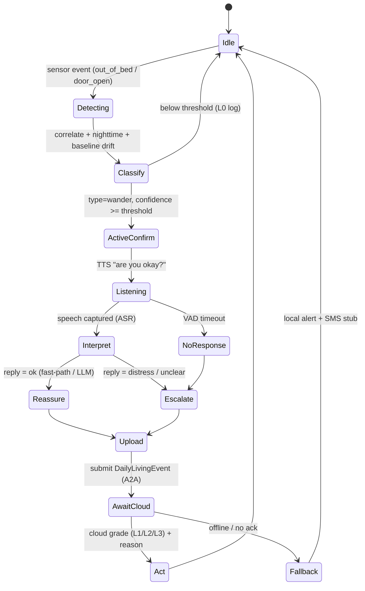

# AiraCare — Edge Agent Design (PoC)

Detailed design for the **edge side** of AiraCare, flagship scenario **Nighttime
Wandering**. This is the approved design that the `edge/` implementation follows.

See also: [architecture.md](architecture.md) · [demo-scenarios.md](demo-scenarios.md).

---

## 1. Locked decisions

| # | Decision | Choice |
|---|---|---|
| 1 | Framework / language | Microsoft Agent Framework + **Python** |
| 2 | Run location | **Devbox** (dev + demo); mic/speaker via RDP **Remote Audio** |
| 3 | Local LLM | **Option B** — LLM interprets the *spoken reply*; event classification stays rule-based; keyword fast-path |
| 4 | Scope | **Flagship Nighttime Wandering only**; video deferred (voice covers the multi-modal bonus) |
| 5 | Cloud | Local **A2A stub** first, protocol-compatible so the real Foundry Hosted Agent drops in later |
| 6 | Models | faster-whisper `small` int8 (ASR) · silero-VAD · Piper (TTS) · Phi-3.5-mini via Ollama (reply understanding) |
| 7 | Audio config | `voice.input: mic \| file` — `mic` = Remote Audio for demo, `file` = deterministic dev |

**Hardware note:** the run target is CPU-only (Hyper-V VM, 8C/64GB — no GPU/NPU), so
all local models are small + int8. The devbox exposes a generic **Remote Audio**
recording endpoint (verified), so live mic/speaker work for a normal app.

## 2. Design principles

- **Privacy boundary is absolute:** raw audio lives only inside `voice/*`; only a
  `DailyLivingEvent` (built from typed models) crosses to the cloud — it is
  *structurally impossible* to attach raw audio to the uplink.
- **Deterministic core, LLM at the edges:** the sense→classify→escalate decision is
  rule-based (reliable for a live demo); the LLM only interprets the spoken reply.
- **Offline-first:** the edge completes its safety job with no network; the cloud is
  an *enhancement*. A local queue + fallback prove the "cable-pull" independence.
- **A2A drop-in:** the local stub speaks the same message contract as the real Foundry
  agent; switching is an endpoint/credential change.

## 3. Repo & module layout

```
edge/
  pyproject.toml            # core deps + optional extras: [audio] [llm] [cloud] [dev]
  config.yaml               # patient, quiet hours, thresholds, voice, cloud
  README.md
  airacare_edge/
    agent.py                # Edge Core FSM (the Agent Framework agent) + service protocols
    config.py               # typed config (pydantic) loaded from config.yaml
    sensors/
      events.py             # RawSensorEvent
      simulator.py          # canned nighttime-wander event injector
    reasoning/
      baseline.py           # rolling baseline + drift (quiet-hours aware)
      classifier.py         # raw events -> DailyLivingEvent (rule-based)
      escalation.py         # reply intent -> edge action / escalate
    voice/                  # (step 4+) tts / asr / vad / dialog — not in step 1
    privacy/                # (step 6) scrub raw audio -> features
    cloud/
      contracts.py          # DailyLivingEvent, ReplyIntent, CloudDecision (pydantic)
      stub.py               # in-process LocalGradingEngine + LocalStubCloudClient
      a2a_client.py         # (step 3) A2A client to stub / Foundry
    ui/
      panel.py              # (step 6) split-screen edge-vs-cloud console panel
  tests/
    test_wander_flow.py     # end-to-end flagship flow (fakes for voice/cloud)
```

## 4. Wandering flow — state machine



## 5. Contracts

```jsonc
// Edge → Cloud (only this crosses the boundary)
DailyLivingEvent {
  "type": "wander",
  "confidence": 0.9,
  "timestamp": "2026-07-13T03:00:12Z",
  "patient_id": "p-001",
  "features": [],                 // privacy-scrubbed; never raw audio
  "baseline_deviation": 0.95,
  "edge_action_taken": "prompted",
  "context": { "time_of_day": "night", "door_open": true, "response": "no_response" }
}

// Cloud → Edge (A2A response)
CloudDecision {
  "grade": "L3",
  "reason": "out-of-bed + door open at night + no response + moderate stage → high wandering risk",
  "actions": [ { "channel": "family", "message": "..." }, { "channel": "community", "message": "..." } ],
  "edge_directive": { "voice_prompt": null }   // L1 carries a prompt to loop back to the edge
}
```

## 6. Service boundaries (protocols — enable testing + swapping)

- `VoiceService`: `say(text)`, `listen(timeout) -> transcript | None`, `interpret(transcript) -> ReplyIntent`
- `CloudClient`: `submit(event) -> CloudDecision | None` (None ⇒ offline)
- `AlertSink`: `local_alert(...)`, `notify_kin_sms(...)`

Step 1 provides fakes/stub implementations so the whole flow runs deterministically
with no mic, no Ollama, no network.

## 7. Config surface (`config.yaml`)

```yaml
patient: { id: p-001, name: "Grandpa Zhang", disease_stage: moderate }
quiet_hours: { start: "22:00", end: "07:00" }
thresholds: { wander_confidence: 0.7, no_response_seconds: 8, correlation_window_seconds: 120 }
voice: { input: file, asr_model: small, tts_voice: en_US-medium, llm_model: phi3.5, use_llm_for_ambiguous: true }
cloud: { mode: stub, a2a_endpoint: "http://localhost:8971/a2a" }
```

## 8. Build order

1. **Contracts + config + Edge Core FSM + local stub + unit tests** (pure logic — no models). ← *this step*
2. Sensor simulator wired to a console run of the full Edge→Cloud→Edge loop.
3. A2A network stub (drop-in for Foundry) + `a2a_client`.
4. Voice: TTS prompt → ASR → VAD timeout (rule path).
5. LLM reply understanding (Ollama) + keyword fast-path.
6. Privacy scrub + split-screen UI panel + offline fallback beat.
7. End-to-end flagship test + demo-script polish; later swap stub → real Foundry.

## 9. Latency & reliability

- **Keyword fast-path** resolves obvious replies instantly; the LLM handles only
  ambiguous replies (masked by a short spoken filler).
- LLM output constrained to tiny JSON (`{status, urgency}`) to minimize latency.
- `no_response_seconds` is configurable (default a touch generous) to stay robust over
  Remote Audio buffering.
