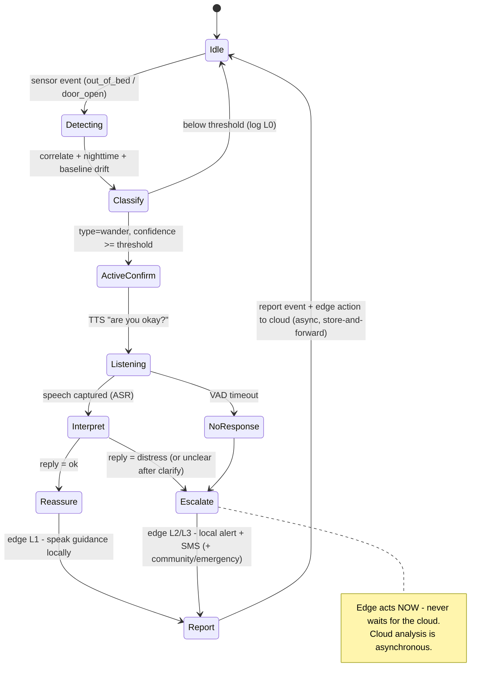

# AiraCare — Edge Agent Design (PoC)

Detailed design for the **edge side** of AiraCare, flagship scenario **Nighttime
Wandering**.

See also: [architecture.md](architecture.md) · [demo-scenarios.md](demo-scenarios.md).

---

## 1. Locked decisions

| # | Decision | Choice |
|---|---|---|
| 1 | Framework / language | Microsoft Agent Framework + **Python** |
| 2 | Run location | **Devbox** (dev + demo); mic/speaker via RDP **Remote Audio** |
| 3 | Local LLM | LLM interprets the *spoken reply*; event classification stays rule-based, with a keyword fast-path in front |
| 4 | Scope | **Flagship Nighttime Wandering only**; video deferred (voice covers the multi-modal bonus) |
| 5 | Cloud | Local **A2A stub** first, protocol-compatible so the real Foundry Hosted Agent drops in later |
| 6 | Models | SAPI TTS (say) · energy VAD · faster-whisper `small` int8 (ASR) · Phi-3.5-mini via Ollama (reply understanding). Optional neural backends: Piper (TTS) + silero-VAD via `[audio-neural]` |
| 7 | Audio config | `voice.input: mic \| file` — `mic` = Remote Audio for demo, `file` = deterministic dev |

**Hardware note:** the run target is CPU-only (Hyper-V VM, 8C/64GB — no GPU/NPU), so
all local models are small + int8. The devbox exposes a generic **Remote Audio**
recording endpoint (verified), so live mic/speaker work for a normal app.

## 2. Design principles

- **Privacy boundary is absolute:** raw audio lives only inside `voice/*`; only a
  `DailyLivingEvent` (built from typed models) crosses to the cloud — it is
  *structurally impossible* to attach raw audio to the uplink.
- **Deterministic core, LLM at the edges:** the sense→classify→escalate decision is
  rule-based (reliable for a live demo); the LLM only interprets the spoken reply.
- **Edge decides and acts autonomously:** the edge **self-determines the immediate graded
  response** (L0 log · L1 reassure · L2 local alert + SMS · L3 escalate) and acts on it
  **immediately** — it **never waits for the cloud**. The cloud's analysis is asynchronous
  and affects records, caregiver enrichment, and *future* policy, not the current action.
  (Critical for an Alzheimer's patient: silence/confusion is itself a risk signal — the
  safe default is act-now, bias-to-escalate.)
- **Offline-first:** the edge completes its safety job with no network; reporting to the
  cloud is fire-and-forget with store-and-forward. A local queue + fallback prove the
  "cable-pull" independence.
- **A2A drop-in:** the local stub speaks the same message contract as the real Foundry
  agent; switching is an endpoint/credential change.

## 3. Repo & module layout

```
edge/
  pyproject.toml            # core deps + optional extras: [audio] [audio-neural] [llm] [cloud] [dev]
  config.yaml               # patient, quiet hours, thresholds, voice, cloud
  README.md
  airacare_edge/
    _console.py             # force UTF-8 stdout (safe emoji when piped on Windows)
    agent.py                # Edge Core FSM + service protocols (Voice/Cloud/Alert)
    cli.py                  # scenario runner (--scenario/--voice/--cloud/--panel)
    main.py                 # scripted console demo
    config.py               # typed config (pydantic) loaded from config.yaml
    sensors/
      events.py             # RawSensorEvent
      simulator.py          # nighttime-wander event injector
    reasoning/
      baseline.py           # rolling baseline + drift (quiet-hours aware)
      classifier.py         # raw events -> DailyLivingEvent (rule-based)
      escalation.py         # reply intent -> edge action / escalate
    voice/
      tts.py                # SAPI TTS (say)
      asr.py                # faster-whisper transcription (listen)
      vad.py                # energy VAD + record_until_silence (no-response timeout)
      nlu.py                # keyword-intent rule path
      llm.py                # Ollama reply understanding (ambiguous replies only)
      service.py            # LocalVoiceService (say / listen / interpret)
      mic_check.py          # manual live-mic smoke test
    privacy/
      scrub.py              # raw audio -> non-reconstructable features
    cloud/
      contracts.py          # DailyLivingEvent, ReplyIntent, CloudDecision (pydantic)
      stub.py               # in-process LocalGradingEngine + LocalStubCloudClient
      a2a_client.py         # A2A/JSON-RPC client (local stub or Foundry)
      a2a_stub.py           # local A2A server (Foundry stand-in)
      factory.py            # build the CloudClient from config
      queue.py              # offline store-and-forward queue
    ui/
      panel.py              # split-screen edge-vs-cloud demo panel
  tests/                    # unit + integration tests (fakes for voice/cloud)
```

## 4. Wandering flow — state machine

The edge **decides and acts on its own**; reporting to the cloud is asynchronous and
never gates the action.



> A separate **async control-plane loop** applies an `EdgePolicyUpdate` from the cloud
> (thresholds, quiet-hours, personalized prompts, geofence, disease-stage) to **future**
> events. It is not part of the per-event flow above.

## 5. Contracts

```jsonc
// Edge → Cloud — a REPORT of what the edge saw AND already did (fire-and-forget).
// Only this crosses the boundary; raw audio/video never does.
DailyLivingEvent {
  "type": "wander",
  "confidence": 0.9,
  "timestamp": "2026-07-13T03:00:12Z",
  "patient_id": "p-001",
  "features": [],                       // privacy-scrubbed; never raw audio
  "baseline_deviation": 0.95,
  "edge_assessed_level": "L3",          // the edge's OWN immediate decision
  "edge_action_taken": "escalated",     // none | reassured | local_alert | escalated
  "context": { "time_of_day": "night", "door_open": true, "response": "no_response" }
}

// Cloud → Edge (async ack) — a CONSIDERED assessment for records + caregiver comms.
// NOT an action the edge waits on; the edge has already acted.
CloudAssessment {
  "considered_level": "L3",
  "reason": "3rd nighttime wander this week + moderate stage → escalating pattern",
  "caregiver_notifications_sent": [ { "channel": "family", "message": "..." } ],
  "policy_version": 7,                  // PIGGYBACK HINT — latest policy the cloud has
  "report_ref": "daily/2026-07-13"
}

// Cloud → Edge (async control plane) — updates how the edge behaves for FUTURE events.
// Produced by the cloud's fusion / multi-agent learning over accumulated events.
EdgePolicyUpdate {
  "version": 7,
  "issued_at": "2026-07-13T09:00:00Z",
  "patient_id": "p-001",
  "thresholds": { "wander_confidence": 0.6, "no_response_seconds": 10 },
  "quiet_hours": { "start": "21:30", "end": "07:00" },
  "voice_prompts": { "reassure": "It's late, Grandpa. Let's go back to bed." },
  "geofence": { "radius_m": 50 },
  "disease_stage": "moderate",
  "notes": "night wandering increasing → lowered threshold + earlier quiet hours"
}
```

**Direction of authority:** `DailyLivingEvent` is a **report** of what the edge saw *and
did* — not a request for permission. `CloudAssessment` is the cloud's *considered* view
(for records + caregiver comms), returned asynchronously and **never gating** the edge's
action. `EdgePolicyUpdate` is the cloud's control-plane feedback — the edge validates and
applies it (versioned) to **future** events.

**Policy delivery = piggyback hint (not per-event):** a policy change is the product of
fusion over *many* events, so it is **not** returned on every report. Instead, each
`CloudAssessment` carries a lightweight `policy_version`. The edge compares it to its
current version and **lazily pulls** a full `EdgePolicyUpdate` (`fetch_policy(patient_id,
since_version)`) **only when it changed** — near-immediate propagation, no blind polling,
no full policy on every event. Offline, the edge keeps using its last-applied policy.

## 6. Service boundaries (protocols — enable testing + swapping)

- `VoiceService`: `say(text)`, `listen(timeout) -> transcript | None`, `interpret(transcript) -> ReplyIntent`
- `AlertSink`: `local_alert(...)`, `notify_kin_sms(...)`, `escalate(...)` — the edge's own
  immediate actions
- `CloudClient`: `report(event) -> CloudAssessment | None` — **fire-and-forget** report;
  `None` ⇒ offline, so the event is queued for store-and-forward. The edge has **already
  acted** before it reports; it never blocks on the response.
- `PolicyClient`: `fetch_policy(patient_id, since_version) -> EdgePolicyUpdate | None` —
  async control-plane; the edge applies the update to future events.

The fake/stub implementations let the whole flow run deterministically with no mic, no
Ollama, and no network (used throughout the tests).

## 7. Config surface (`config.yaml`)

```yaml
patient: { id: p-001, name: "Grandpa Zhang", disease_stage: moderate }
quiet_hours: { start: "22:00", end: "07:00" }
thresholds: { wander_confidence: 0.7, no_response_seconds: 8, correlation_window_seconds: 120 }
voice: { input: file, asr_model: small, tts_voice: en_US-medium, llm_model: phi3.5, use_llm_for_ambiguous: true, max_clarify_retries: 1 }
cloud: { mode: stub, a2a_endpoint: "http://localhost:8971/a2a" }
```

> `max_clarify_retries: 1` — on an `unclear` reply the agent re-asks **once**, then
> escalates. Never loops indefinitely: for an Alzheimer's patient, prolonged silence or
> confusion is itself a risk signal, so the safe default is *ask once more, then escalate*.

## 8. Build order

1. **Contracts + config + Edge Core FSM + local stub + unit tests** (pure logic — no models).
2. Sensor simulator wired to a console run of the full Edge→Cloud→Edge loop.
3. A2A network stub (drop-in for Foundry) + `a2a_client`.
4. Voice: TTS prompt → ASR → VAD timeout (rule path).
5. LLM reply understanding (Ollama) + keyword fast-path.
6. Privacy scrub + split-screen UI panel + offline fallback beat.
7. End-to-end flagship test + demo-script polish; later swap stub → real Foundry.

## 9. Latency & reliability

- **Keyword fast-path** resolves obvious replies instantly; the LLM handles only
  ambiguous replies (masked by a short spoken filler).
- LLM output constrained to a tiny JSON (`{status}`) to minimize latency.
- `no_response_seconds` is configurable (default a touch generous) to stay robust over
  Remote Audio buffering.

## 10. Voice pipeline — roles & actors

The active-confirm dialogue is a spoken exchange between **two actors**: the **AiraCare
edge agent** and the **patient**. The agent's side is its *mouth* (speak) and its
*brain* (understand); the patient's spoken response is perceived through the agent's
*ear → attention → transcriber*. **Silence is a valid reply** — treated as
`no_response` and escalated.

```
SAPI TTS speaks prompt → mic records → energy VAD (speech? / silence-timeout?)
                      → faster-whisper transcribes → Ollama interprets meaning
```

> **Backends:** the PoC ships with **SAPI TTS** (offline, no model download on Windows)
> and a lightweight **energy VAD**. Higher-fidelity neural backends — **Piper** (TTS) and
> **silero-VAD** — are available via the `[audio-neural]` extra and drop in behind the
> same interfaces.

| # | Step | Component | Actor / role | Input → Output |
|---|---|---|---|---|
| 1 | TTS speaks prompt | SAPI TTS (Piper optional) | 🗣️ **Agent — mouth**: voices the prompt aloud | text → speaker audio |
| 2 | Mic records | mic + `sounddevice` (Remote Audio) | 👂 **Agent — ear (capture)**: records the patient (or silence) | sound → raw audio (stays on device) |
| 3 | VAD | energy VAD (silero optional) | 🎯 **Agent — attention / turn-taking**: is anyone speaking? when did they stop? fires the **no-response timeout** | audio frames → speech/no-speech + silence-timeout |
| 4 | faster-whisper transcribes | faster-whisper ASR | ✍️ **Agent — transcriber**: speech → words | speech audio → transcript text |
| 5 | Ollama interprets meaning | Phi-3.5-mini via Ollama | 🧠 **Agent — comprehension**: what did the reply mean? | transcript → `ReplyIntent{status, urgency}` |
| — | (responds by voice or stays silent) | — | 🧑‍🦳 **Patient — the second speaker**: the response steps 2–4 perceive | speech / silence |

**Mapping to the `VoiceService` protocol** (the Edge Core FSM is unchanged — these steps
live entirely behind the protocol):

| `VoiceService` method | Pipeline steps | Returns |
|---|---|---|
| `say(text)` | 1 (TTS) | — |
| `listen(timeout)` | 2 + 3 + 4 (mic → VAD → whisper) | transcript, or **`None`** on silence-timeout |
| `interpret(transcript)` | 5 (keyword fast-path → Ollama) | `ReplyIntent` |

**Safety vs. enhancement:**
- Step **3 (VAD silence-timeout)** is on the *safety path* — "no response → escalate" —
  so it is rule-based and must be robust.
- Step **5 (Ollama)** is *not* on the classification path; it only interprets what was
  said, with a **keyword fast-path** in front ("help"/"fine" resolve instantly).

**Bounded clarify loop (`max_clarify_retries: 1`):** if step 5 returns `unclear`, the
agent re-asks **once** ("I didn't catch that — are you okay?") then escalates. It never
loops indefinitely.

**Privacy:** raw audio exists only inside steps 2–4 and is discarded after
transcription. Only `ReplyIntent.status` flows into `DailyLivingEvent.context.response`
— **no audio ever crosses to the cloud.**
