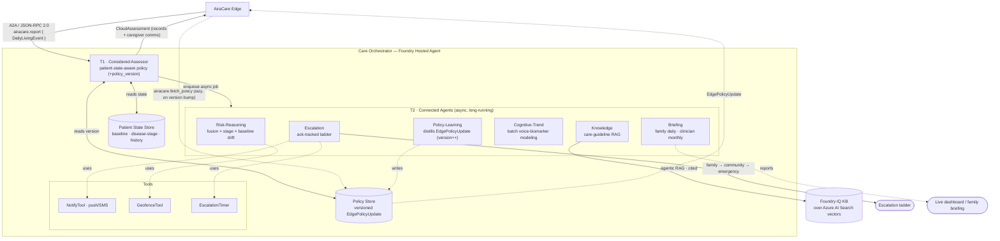

# AiraCare — Foundry Care Orchestrator Design (PoC)

Detailed design for the **cloud side** of AiraCare — the **Foundry Care Orchestrator**
that the edge talks to over A2A. Flagship scenario **Nighttime Wandering**.

See also: [architecture.md](architecture.md) · [edge-design.md](edge-design.md) ·
[demo-scenarios.md](demo-scenarios.md) · [demo-runbook.md](demo-runbook.md).

The edge is authoritative: it **decides L0–L3 and acts immediately, and never waits for
the cloud**. The cloud is therefore **off the real-time safety path**. The edge freezes
the contract (`airacare.report` → `CloudAssessment`, `airacare.fetch_policy` →
`EdgePolicyUpdate`); the Foundry Care Orchestrator is a **drop-in replacement for the
local `LocalCloudStub`** that speaks the same A2A wire protocol but adds real depth:
personalized *considered* assessment, knowledge-grounded caregiver comms, an autonomous
ack-tracked escalation ladder, longitudinal trends/briefings, and the **policy learning**
that tunes the edge's future behavior.

---

## 1. Locked decisions

| # | Decision | Choice |
|---|---|---|
| 1 | Runtime | **Azure AI Foundry Agent Service** — Care Orchestrator as a **Hosted Agent** |
| 2 | Multi-agent | **Foundry Connected Agents** for the deliberate (T2) orchestration |
| 3 | Latency strategy | **Off the safety path** — the edge already acted. The report returns a quick **considered assessment** (records + immediate caregiver comms); deep reasoning, the escalation ladder, trends, and policy learning run **asynchronously** (T2). |
| 4 | Knowledge | **Foundry IQ** knowledge base — *agentic* RAG over care guidelines (documents indexed in Azure AI Search with `text-embedding-3-small` vectors + hybrid retrieval, `gpt-5.4` as the query planner); the `search_care_guidelines` tool returns **cited** snippets. *(Built on Azure AI Search under the hood, but Foundry IQ owns the retrieval — see `foundry-hosted-agent/knowledge/`.)* |
| 5 | Models | The **T1 considered assessment is deterministic / rule-based (no model)** — it must be reproducible on the safety-adjacent path. Only the **T2 advisory narrative** (the hosted conversational agent + its five connected specialists) uses an LLM: **`gpt-5.4`** (`gpt-5.4-mini` for lighter deploys). The model never sets or changes the risk level. |
| 6 | Data (see §7) | **Demo/MVP = local store (SQLite/in-memory)**; **production target = Cosmos DB (operational) mirrored into Microsoft Fabric/OneLake for analytics + Power BI** |
| 7 | Notifications | **Cloud-owned** enriched dispatch + timed ack-tracked escalation ladder (the edge already fired its own immediate local alert + SMS to kin) |
| 8 | Drop-in | Same A2A `airacare.report` / `airacare.fetch_policy` contract → edge switches via `cloud.mode: foundry` only |
| 9 | MVP scope | Flagship **wander** considered assessment + escalation ladder + one knowledge-grounded advice + family briefing + a `policy_version` bump the edge pulls |

**What drives the design:** the edge never blocks on the cloud, so there is **no hard
real-time budget on the safety path**. The report call still returns promptly (the edge's
report worker uses a ~5 s timeout, then falls back to the store-and-forward queue), but a
slow or missing response only delays *records and caregiver enrichment* — never the
patient-facing action, which already happened on the edge.

> **As built (reconciled to reality).** The cloud is a **single deployed hosted agent**
> (`foundry-hosted-agent/`) plus a **standalone read-only dashboard** (`dashboard/`):
> - **`foundry-hosted-agent/`** — the **deployed Azure AI Foundry Agent Service** agent that
>   answers the edge over the **standard A2A protocol** (`message/send` + `tasks/get`).
>   **Deterministic pre-model middleware** (pure Python, no LLM on the safety verdict) computes the
>   considered level + runs the escalation ladder and returns it in a `CONSIDERED ASSESSMENT (JSON)`
>   block; a persistence middleware writes derived `DailyLivingEvent`s to **Cosmos DB via Managed
>   Identity**. The **model** narrates a caregiver briefing grounded by a **Foundry IQ** knowledge
>   base (agentic RAG over Azure AI Search) on **`gpt-5.4`** — **advisory / narrative only**, it
>   never sets the risk level or triggers escalation. The retired `foundry-a2a-server` is gone; the
>   edge speaks A2A directly to this agent.
> - **`dashboard/`** — a self-contained **live care dashboard** (stdlib server + Chart.js) that
>   *reads* the same Cosmos `daily_event` store the hosted agent writes. Read-only; off the safety
>   path.
>
> Divergences from the original decisions above, now folded in: the deployed agent speaks the
> **standard A2A wire** (`message/send` + `tasks/get`), **not** the bespoke `airacare.report` /
> `airacare.fetch_policy` JSON-RPC in §3/§13 below — that framing describes the retired local stub,
> which the edge still uses in `cloud.mode: a2a`. The **control-plane policy channel is not built on
> the deployed path**: `fetch_policy` is a no-op and the hosted agent always reports
> `policy_version = 1`, so the edge never pulls an `EdgePolicyUpdate` (policy learning, §8/#8/#9,
> remains a **design target only**; the edge + local stub still model it end-to-end). The T2
> orchestration is **five** MAF specialist sub-agents exposed **as tools** (risk-reasoning, knowledge,
> escalation, cognitive-trend, briefing) under one `care-orchestrator` Agent — not six, and not
> Foundry "Connected Agents" in the portal sense; policy-learning was dropped. Knowledge moved from
> raw Azure AI Search to **Foundry IQ** (#4); models are **`gpt-5.4`/`gpt-5.4-mini`**, not GPT-4o
> (#5); analytics is a **self-hosted live dashboard** rather than Power BI on OneLake (#6, still the
> stated production target); and the deterministic assessment/escalation that once lived in a
> separate A2A server now runs **inside the hosted agent** as pre-model middleware. The frozen edge
> report contract (`airacare.report` → `CloudAssessment`) is unchanged.

## 2. Design principles

- **Edge acts, cloud reflects.** The edge has already decided and acted by the time the
  report arrives. The cloud never returns an action the edge waits on; it produces a
  *considered* assessment (for records + caregiver comms) and, separately, **policy** that
  tunes the edge's **future** behavior. Nothing here is on the real-time safety path.
- **Drop-in, not rebuild.** The Foundry agent honors the exact `airacare.report` →
  `CloudAssessment` and `airacare.fetch_policy` → `EdgePolicyUpdate` contract the edge
  already speaks. Switching from the local stub is a config change (`cloud.mode: foundry`),
  never an edge code change.
- **The cloud owns enriched notifications & escalation.** The edge fires its **own**
  immediate local action (light/sound, SMS to next of kin, or escalate) without waiting.
  The cloud then runs the **ack-tracked multi-channel ladder** (family → community →
  emergency) and enriches caregiver comms with fused history — it has the contact
  directory and the escalation timers.
- **Feedback as policy, not commands.** The cloud never micromanages a single event; its
  learning is distilled into an **`EdgePolicyUpdate`** (thresholds, clarify retries,
  personalized prompts, disease-stage) delivered lazily via the `policy_version` piggyback hint.
- **Privacy boundary is inherited and absolute.** Only `DailyLivingEvent` crosses;
  everything the cloud stores is **derived** from it. No raw audio/video/point-cloud is
  persisted anywhere, edge or cloud.
- **Cheap fast-path, expensive only when needed.** The considered assessment is
  policy/light-model; the LLM + RAG multi-agent deliberation only fires on real events
  (the edge already filters ~99% of no-event data) — token-frugal.

## 3. The frozen contract (inherited from the edge)

```jsonc
// Inbound — A2A / JSON-RPC 2.0 — a REPORT of what the edge saw AND already did
{ "jsonrpc":"2.0", "id":1, "method":"airacare.report",
  "params": { "event": DailyLivingEvent } }

// DailyLivingEvent (the ONLY thing that crosses the privacy boundary)
DailyLivingEvent {
  type: "fall|wander|med|meal|routine", confidence, timestamp, patient_id,
  features: [float],                 // privacy-scrubbed; never raw audio
  baseline_deviation,
  edge_assessed_level: "L0|L1|L2|L3",             // the edge's OWN immediate decision
  edge_action_taken: "none|reassured|local_alert|escalated",  // what the edge already did
  context: { time_of_day, door_open, response, ... }
}

// Outbound — CloudAssessment (async ack; the edge has ALREADY acted, it does not wait)
CloudAssessment {
  considered_level: "L0|L1|L2|L3",   // may match, enrich, or refine the edge's level
  reason: "explainable why",
  caregiver_notifications: [ { channel:"family|community|emergency", message, target } ],
  policy_version: 7,                 // PIGGYBACK HINT — latest policy the cloud has
  report_ref: "daily/2026-07-13"     // where this event was filed
}

// Inbound — lazy policy pull, only when the piggybacked policy_version changed
{ "jsonrpc":"2.0", "id":2, "method":"airacare.fetch_policy",
  "params": { "patient_id": "p-001", "since_version": 1 } }

// Outbound — EdgePolicyUpdate (tunes the edge's FUTURE behavior; null if unchanged)
EdgePolicyUpdate {
  version: 7, issued_at, patient_id,
  wander_confidence, no_response_seconds, max_clarify_retries,   // thresholds
  confirm_prompt, reassure_prompt, clarify_prompt,               // personalized prompts
  disease_stage, notes
}
```

## 4. Two-tier processing (both OFF the safety path)

The edge never waits, so neither tier has a real-time deadline. The split is about the
*responsiveness of records/comms* vs *depth of reasoning*, not about gating the edge.

| Tier | When | What | Target |
|---|---|---|---|
| **T1 — Considered assessment** (on the report call) | every reported event | patient-state-aware policy → `CloudAssessment` (considered level + reason + the caregiver comms it is initiating + current `policy_version`). Reads hot patient state (baseline, disease stage). | **prompt** (~1 s; the edge worker times out ~5 s → store-and-forward) |
| **T2 — Deliberate** (async, long-running) | after the report reply | Connected Agents: knowledge-ground the advice, run the **ack-tracked** multi-channel escalation ladder, update baseline/trend, generate briefings, and **distill an `EdgePolicyUpdate`** (bumping `policy_version`) the edge pulls lazily. | seconds–minutes, autonomous |

This split is also the answer to the judges' *"long-running autonomous / token-hungry?"*
questions: the autonomous escalation + trend + policy-learning work lives in T2; tokens are
spent only on real events, and heavy analytics is offloaded to compute (not the LLM).

## 5. Architecture on Azure AI Foundry



## 6. Assessment policy (how the considered level is decided)

The considered level combines three inputs, weighted by disease stage:

`risk = f(event.type, event.confidence, baseline_deviation, context) × disease_stage_weight`

Flagship **wander** policy (parity with the current stub, now personalized). The edge has
**already acted** on its `edge_assessed_level`; the cloud's `considered_level` may match,
enrich, or refine it, and drives the caregiver comms:

| Reply / context (from the report) | Considered | Cloud action (enriched, ack-tracked) |
|---|---|---|
| `no_response` / `distress` | **L3** | notify family → (ladder) community → emergency, with fused context |
| `unclear` | **L2** | notify family to check + "3rd wander this week" enrichment |
| `ok` (patient reassured) | **L1** | none (log); note the pattern → personalize the future `reassure_prompt` (policy) |
| below confidence threshold | **L0** | log only → daily briefing |

Disease stage tunes thresholds (e.g. a *severe*-stage patient's nighttime out-of-bed
weights higher). The **reason** string is always populated for explainability, and is
enriched by the Knowledge agent in T2. When the cloud's view diverges from the edge's over
time (e.g. it wants an earlier confirm threshold), it encodes that as an **`EdgePolicyUpdate`**
— never as a per-event command.

## 7. Data & storage (decision #6 = **C**)

**Demo / MVP (build now):** the considered assessment + escalation run against a **tiny
local store** — SQLite (or in-memory) holding per-patient baseline, disease stage, and
recent event history. This keeps the report response prompt and adds **zero cloud
infrastructure** to the live demo.

**Production target (stated, not built for the hackathon):** split by workload and let
Fabric mirror handle analytics with no ETL:

| Data | Store | Notes |
|---|---|---|
| **Raw audio/video/point-cloud** | **nowhere** — edge RAM only, discarded after feature extraction | the privacy boundary |
| Offline event backlog | **edge disk** `.airacare_queue/` (TTL-bounded) | already built |
| **Patient State** (baseline, stage, contacts, history) | **Azure Cosmos DB**, partition = `patient_id` | single-digit-ms → keeps the report response prompt |
| **Edge policy** (versioned per patient) | **Azure Cosmos DB**, partition = `patient_id` | served by `fetch_policy`; edge pulls on a `policy_version` bump |
| Analytics / trends / longitudinal modeling | **Microsoft Fabric** (Eventhouse/KQL + Lakehouse/Delta, Spark) via **Cosmos→OneLake mirroring** | zero-copy, no ETL *(stated production target — not built; superseded for the demo by the live dashboard below)* |
| Family daily / clinician monthly reports | **Live care dashboard** (`dashboard/`, stdlib server + Chart.js) reading the same Cosmos `daily_event` store; Power BI on OneLake is the stated production target | native dashboards |
| Condition-based alert triggers | **Data Activator** | complements the agent's escalation ladder *(stated production target — not built)* |
| Care-guidelines KB (RAG) | **Foundry IQ** knowledge base (agentic retrieval over Azure AI Search vectors, `gpt-5.4` planner) | enterprise knowledge, kept separate from patient data; returns **cited** snippets |

**Why C for the hackathon:** standing up the full Fabric stack is hours of infra a judge
never sees and adds live-demo failure surface. Cosmos→OneLake **mirroring means
graduating local → Cosmos is a swap, not a rewrite**, and analytics is never migrated.
For the pitch, feed **one Power BI dashboard** with exported/sample events to sell the
"clinician view / population-health / biz potential" — one screenshot buys that
criterion; a live pipeline does not buy more.

**Privacy invariant (unchanged):** only `DailyLivingEvent` crosses; OneLake/Cosmos store
only structured/derived data; **no raw modality data is ever persisted**.

## 8. Notifications & escalation ladder (cloud-owned, long-running)

L3 is not one message — it is an **autonomous timed ladder**:

```
notify family ──(ack? within T_family)──► resolve
     │ no ack
     ▼
notify community/watch ──(ack? within T_community)──► resolve
     │ no ack
     ▼
emergency (120 / caregiver-on-call), attach location + event context
```

The Escalation agent + `EscalationTimer` tool own this. Note the edge has **already** fired
its own immediate local alert + SMS to next of kin the moment it graded L2/L3 — the cloud
does **not** blindly repeat that; it runs the **ack-tracked multi-channel ladder** and
enriches with fused context. The `caregiver_notifications` returned on the report are an
**audit record** of what the cloud is initiating; the actual sends and ack-waits happen in
T2. This is the concrete "long-running autonomous agent."

## 9. Multi-modal understanding (honest framing under the privacy boundary)

Because raw modality data stays on the edge, Foundry's multi-modal understanding is over
**fused feature/event streams + longitudinal history**:
- **Now:** fuse radar out-of-bed + door-open + voice `ReplyIntent` + baseline drift into
  one risk judgment.
- **Over weeks:** the Cognitive-Trend agent batch-models scrubbed **voice-biomarker
  features** into a cognitive trajectory (this hits the multi-modal / streaming-plus-batch
  bonus). Heavy modeling is **compute, not tokens** — keeps the agent frugal.

## 10. Repo / module layout — as built

**One deployed hosted agent + one standalone dashboard:**

```
foundry-hosted-agent/            # the DEPLOYED Azure AI Foundry Agent Service agent (answers standard A2A)
  azure.yaml                     # azd + microsoft.foundry: model deployment + hosted agent (protocols: [a2a, responses])
  pyproject.toml                 # offline test/lint config for the ported deterministic logic
  knowledge/                     # care-guideline corpus + Foundry IQ knowledge-base setup
  infra/                         # provision_foundry_iq.py etc. (IaC / provisioning helpers)
  src/airacare-care-orchestrator/
    main.py                      # the hosted agent: deterministic middleware + orchestrator/narrator on gpt-5.4
                                 #   ConsideredAssessmentMiddleware (pre-model): compute considered level + start
                                 #     escalation ladder + stash verdict; post-model: append CONSIDERED ASSESSMENT (JSON)
                                 #   DailyEventPersistenceMiddleware: write scrubbed DailyLivingEvent to Cosmos (via MI)
    airacare_care/               # ported deterministic core (pure Python, no LLM on the safety verdict)
      assessor.py                # patient-state-aware considered-level policy (parity+ with the edge stub)
      escalation.py              # ack-tracked family→community→emergency ladder
      escalation_timer.py        # Scheduler protocol + thread/manual timers
      state.py                   # PatientState resolution
      notify.py                  # caregiver notification tool
      render.py                  # renders the CONSIDERED ASSESSMENT (JSON) block the edge parses
      contracts.py               # the SAME DailyLivingEvent / CloudAssessment models (byte-compatible with edge)
    eval/ · evaluators/          # agent evaluation suite (golden set + rubric)
    Dockerfile · requirements.txt
  tests/
    test_considered_assessor.py  # deterministic considered-level parity + personalization
    test_escalation.py           # ack-tracked ladder
    test_render.py               # the CONSIDERED ASSESSMENT (JSON) block

dashboard/                       # the STANDALONE live care dashboard (read-only over Cosmos; off the safety path)
  pyproject.toml                 # deps: pydantic + pyyaml (+ optional [cosmos] = azure-cosmos + azure-identity)
  config.cosmos.yaml             # sample live config (store.backend: cosmos, key via ${AIRACARE_COSMOS_KEY} or AAD)
  airacare_dashboard/
    server.py                    # stdlib http.server + CLI (python -m airacare_dashboard.server); default port 8975
    data.py                      # DashboardData: filed events -> the dashboard JSON payload
    analytics.py                 # cognitive trend + briefings + flattened rows (compute, not tokens)
    stores.py                    # store protocols + LocalEventStore + CosmosEventStore (reads the hosted agent's daily_event)
    seed.py                      # deterministic demo month (offline dry-run / tests only)
    config.py · contracts.py     # DashboardConfig (patient + store); trimmed read-only DailyLivingEvent
    static/                      # single-page front-end (index.html, app.css, app.js — Chart.js via CDN)
  tests/
    test_dashboard.py            # data layer + HTTP endpoints (offline; in-memory SQLite + ephemeral-port smoke)
```

The `contracts.py` in each folder stays byte-compatible with `edge/airacare_edge/cloud/contracts.py`
(share or vendor the same pydantic models). The edge reaches the hosted agent over **standard A2A**
(`edge/airacare_edge/cloud/foundry_client.py`); there is **no bespoke A2A server** — the former
`foundry-a2a-server/` has been retired and its deterministic logic ported into the hosted agent.

## 11. Build order (MVP-first)

1. **Considered assessor** returning the flagship `wander` `CloudAssessment` with **parity to the
   edge stub** (proves the deterministic verdict; `test_considered_assessor`). *(As built: this runs
   as **pre-model middleware inside the hosted agent**, returning the level in a `CONSIDERED
   ASSESSMENT (JSON)` block over standard A2A — not a separate server.)* ← start here
2. **Local PatientStateStore** (SQLite) + disease-stage/baseline personalization in the
   considered assessment.
3. **Async escalation ladder** (family→community→emergency + ack timers) — the
   long-running story.
4. **Knowledge agent** → grounded advice woven into `reason`/briefing. *(As built: local
   in-memory RAG for the offline demo; production graduated to a **Foundry IQ** knowledge
   base — agentic RAG over Azure AI Search — in `foundry-hosted-agent/`.)*
5. **Cognitive-Trend + Briefing agents** (batch) → clinician/family reporting. *(As built:
   a **standalone live care dashboard** — `dashboard/`, stdlib server + Chart.js — reading the
   hosted agent's Cosmos `daily_event` store; plus a Power BI CSV export as a static pitch asset.)*
6. Swap edge `cloud.mode: foundry`, run the **demo-runbook** end-to-end against real
   Foundry.

> **Status (2026-07): all six done, plus the cloud graduation.** The deterministic core ships the
> flagship parity, personalization, async escalation ladder, knowledge grounding, and trend +
> briefing, and the edge flip is proven e2e. Beyond the MVP: that deterministic logic now runs
> **inside the deployed hosted agent** as pre-model middleware (the standalone A2A drop-in server was
> retired), reached over **standard A2A**; the conversational agent is **deployed to Azure AI Foundry
> Agent Service** on `gpt-5.4` with a **Foundry IQ** KB; events persist to **Cosmos DB via Managed
> Identity**; there is an **agent evaluation suite** and a **live dashboard verified against live
> Cosmos**. Not built on the deployed path: the **policy-learning / `EdgePolicyUpdate` control-plane
> channel** (design-only; retired with the standalone server). Still stated-but-deferred:
> Fabric/OneLake mirroring, Power BI on OneLake, Data Activator, a real GeofenceTool, and real
> streaming voice-biomarker extraction (§9).

## 12. Mapping to the challenge criteria

| Foundry capability the challenge asks for | Where it lives here |
|---|---|
| Deep reasoning & planning | Risk-Reasoning agent; disease-stage × baseline × fusion policy |
| Enterprise knowledge access | Knowledge specialist → **Foundry IQ** KB (agentic RAG over Azure AI Search, cited snippets) |
| Multi-agent orchestration | Care Orchestrator + five specialist sub-agents exposed as tools on the Microsoft Agent Framework (§5), deployed to Agent Service |
| Toolboxes / Skills / Hosted Agents | Notify/Geofence/EscalationTimer tools; `search_care_guidelines` + Cosmos data tools; Hosted Agent runtime |
| Complex multi-modal understanding | fused event streams + longitudinal voice-biomarker modeling (§9) |
| Long-running autonomous | ack-tracked escalation ladder + batch trend/briefing (T2, §8); policy learning is a design target only |
| Token-frugal | the considered-assessment policy is cheap (no model); LLM/RAG only on real events; analytics is compute |
| Vertical template / biz potential | `DailyLivingEvent` one-engine model + the **live care dashboard** (Fabric/Power BI is the production target) |

## 13. Switching the edge from stub → Foundry

No edge code change — config only:
```yaml
cloud:
  mode: foundry
  a2a_endpoint: "https://<foundry-hosted-agent-endpoint>/.../protocols/a2a"
  a2a_token: "${AIRACARE_A2A_TOKEN}"   # or DefaultAzureCredential fallback
```
`mode: foundry` uses the **standard-A2A** `FoundryA2AClient` (`message/send` + `tasks/get`, Entra
auth), which forwards the event and parses the deterministic `CONSIDERED ASSESSMENT (JSON)` block
back into a `CloudAssessment`. This is **not** wire-identical to the local `a2a_stub` (that stub
speaks the bespoke `airacare.report` JSON-RPC and is what `cloud.mode: a2a` targets). On the Foundry
path `fetch_policy` is a no-op — the hosted agent has no control-plane policy channel — so the edge
never pulls an `EdgePolicyUpdate`.
